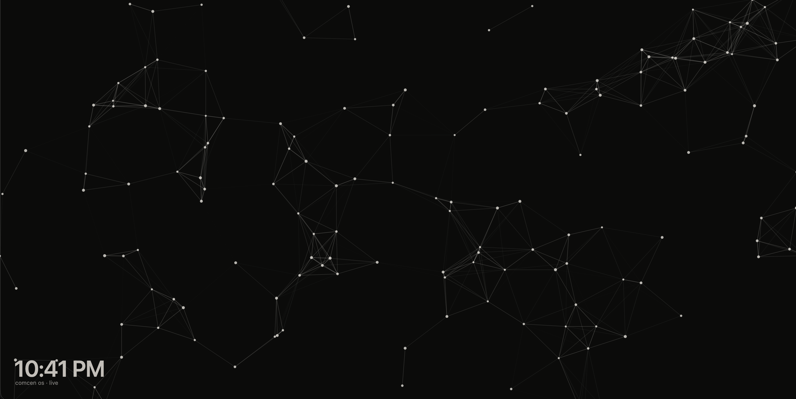

<p align="center">
  
</p>
<p align="center">
  <a href="https://github.com/Yeraze/MeshMonitor">
    
  </a>
  
  <a href="https://opensource.org/licenses/MIT">
    
  </a>
</p>

# 📡 Mesh Screensaver

Your [**Meshtastic**](https://meshtastic.org/) mesh as a screen saver, on **Windows, macOS, and Linux**. Your nodes drift across a dark screen, links join the ones in reach, and every message sent on the mesh travels across it as an orange packet, live from your own [**MeshMonitor**](https://github.com/Yeraze/MeshMonitor).

<p align="center">
  
</p>

This repository contains:
- **core/** — the drawing core and the MeshMonitor client in plain C, shared by all three systems
- **macos/** — the `.saver` for macOS (Swift)
- **windows/** — the `.scr` for Windows (C, GDI+)
- **linux/** — the XScreenSaver hack for Linux (C, cairo)
- **tests/** and **tools/** — tests, a fake MeshMonitor, and a preview renderer
- **docs/** — the developer guide, the logo, and the screenshot

---

## What it shows

| On screen | What it means |
| --- | --- |
| **Dots** | Your active nodes: the ones MeshMonitor heard in the last 7 days, up to 160 |
| **Lines** | Nodes that are near each other on screen. The layout is for looks; it isn't a map or the radio links |
| **Orange packet** | A message, hopping along the lines from sender to recipient |
| **Ripple** | A broadcast, spreading three hops out from the sender |
| **Pulse** | The sender of a message; nearby nodes get a nudge and drift back |
| **Clock** | The time, with Mesh, your name, or your own text under it, and "live" while connected |

Design goals:
- Free, with nothing to sign up for beyond your own MeshMonitor
- Message text is never shown on screen
- Works without a server: a simulated mesh until MeshMonitor answers, and again if it stops
- Small native programs on every system, no web view

---

## Installing

Download the file for your computer from the [latest release](https://github.com/maxhayim/screensaver-mesh/releases/latest):

| System | File |
| --- | --- |
| macOS 11 and later (Apple silicon and Intel) | `screensaver-mesh-<version>-macos.zip` |
| Windows 10 and 11 (64-bit) | `screensaver-mesh-<version>-windows.zip` |
| Linux with XScreenSaver (x86-64) | `screensaver-mesh-<version>-linux-x86_64.tar.gz` |

Mesh isn't code-signed or notarized (that costs money every year), so macOS and Windows warn you the first time. The steps below get you past that once.

### macOS

1. Unzip and double-click `Mesh.saver`, then choose to install it for this user.
2. macOS blocks it the first time. Open **System Settings → Privacy & Security**, scroll down, and click **Open Anyway**. Or run this in Terminal:
   ```
   xattr -d com.apple.quarantine ~/Library/Screen\ Savers/Mesh.saver
   ```
3. Choose **Mesh** in **System Settings → Screen Saver**, and click **Options…** to set it up.

### Windows

1. Unzip, and keep `Mesh.scr` somewhere permanent, like `Documents\Mesh`.
2. Right-click `Mesh.scr` and choose **Install**. If Windows says "Windows protected your PC", click **More info**, then **Run anyway**.
3. In **Screen Saver Settings**, choose **Mesh** and click **Settings** to set it up.

### Linux

1. Install XScreenSaver if you don't have it (for example `sudo apt install xscreensaver`).
2. Unpack the tarball and run `./install.sh`.
3. Add your server and token to `~/.config/screensaver-mesh/config` (the installer creates it from `config.example`).
4. Choose **Mesh** in `xscreensaver-settings`. Try it in a window first with `./screensaver-mesh`.

GNOME and KDE don't support third-party screen savers, so XScreenSaver is the way to run it on Linux.

### Updating

Install the new release over the old one: double-click the new `Mesh.saver` on macOS, replace `Mesh.scr` in the same folder on Windows, or run the new `install.sh` on Linux. Your settings carry over.

---

## Using it

### MeshMonitor

1. In MeshMonitor, create an API token under **User Settings** (it starts with `mm_v1_`). A read-only user is plenty: Mesh only reads nodes and messages.
2. In Mesh's settings, enter the server, like `https://meshmonitor.example.com` or `http://192.168.1.20:8080` (with no `http://` or `https://`, it uses `https://`), and the token. On macOS, **Paste** fills the token from the clipboard and **Show** lets you check it.
3. Leave **Source** blank to use your first source, or enter a source ID from MeshMonitor.
4. Click **Test connection** (macOS and Windows). It shows how many active nodes it found.

Mesh is a program, not a web page, so there's nothing to add to MeshMonitor's `ALLOWED_ORIGINS`.

### Colors

Pick dots, lines, packets, and background, or start from a preset: **Default**, **Meshtastic**, **Green terminal**, **Amber terminal**, or **Paper**.

### Clock and label

Show the clock or hide it, in 12- or 24-hour time. The line under it can say **Mesh**, **your name** (the full name on your computer account), or **your own text**, like a call sign.

### Where the settings are

- **macOS:** **Options…** next to Mesh in **System Settings → Screen Saver**
- **Windows:** **Settings** in **Screen Saver Settings**
- **Linux:** `~/.config/screensaver-mesh/config` (see `config.example`). The XScreenSaver settings page also has the server, color presets, clock, and label; keep the token in the config file, because options on that page end up on the command line, where other users of the computer can see them.

---

## Privacy

- Mesh talks only to your MeshMonitor server. Nothing is sent anywhere else.
- It never shows message text, and never shows node names or IDs.
- The token is kept on your computer, in plain storage rather than a keychain: in the screen saver's preferences on macOS, in the registry under `HKEY_CURRENT_USER\Software\maxhayim\screensaver-mesh` on Windows, and in your config file on Linux. Use a read-only MeshMonitor token.
- While the screen saver runs, it asks MeshMonitor for new messages every 4 seconds and for nodes every 5 minutes.

---

## Repository layout

```
core/mesh.c           the simulation and drawing, through two callbacks (line, circle)
core/meshmonitor.c    MeshMonitor settings, URLs, and responses (Windows and Linux)
core/json.c           a small JSON reader
macos/                the .saver: the view, the MeshMonitor client, the Options sheet
windows/              the .scr: Win32 + GDI+, WinHTTP, the settings dialog
linux/                the XScreenSaver hack, its settings XML, installer, and example config
tests/                core and MeshMonitor tests
tools/                a fake MeshMonitor and the macOS preview renderer
docs/GUIDE.md         developer guide
docs/assets/          logo and screenshot
```

---

## Changing it

See [docs/GUIDE.md](docs/GUIDE.md).

```
macos/build.sh        # build/Mesh.saver (needs the Xcode command-line tools)
windows/build.sh      # build/Mesh.scr (cross-compiles with mingw-w64)
make -C linux         # build/screensaver-mesh (needs libx11, cairo, and libcurl dev packages)
```

GitHub Actions builds and tests all three on every push, and publishes a release for every version tag.

---

## Versioning

This project follows semantic versioning.

- **v0.1.2** — pasting the API token works on macOS
- **v0.1.1** — `http://` servers on macOS, a picture in the screen saver list, and your own label under the clock
- **v0.1.0** — the Mesh screen saver for macOS, Windows, and Linux, live from MeshMonitor

See [CHANGELOG.md](CHANGELOG.md) for details.

---

## License

This project is licensed under the MIT License.

See the [LICENSE](LICENSE) file for details.  
Full license text: https://opensource.org/licenses/MIT

---

## Contributing

Pull requests are welcome. Open an issue first to discuss ideas or report bugs. See [CONTRIBUTING.md](CONTRIBUTING.md).

---

## Acknowledgments

* [MeshMonitor](https://github.com/Yeraze/MeshMonitor) built by [Yeraze](https://github.com/Yeraze)
* [Meshtastic](https://meshtastic.org/)
* [XScreenSaver](https://www.jwz.org/xscreensaver/) by Jamie Zawinski
* [cairo](https://www.cairographics.org/) and [libcurl](https://curl.se/libcurl/) on Linux
